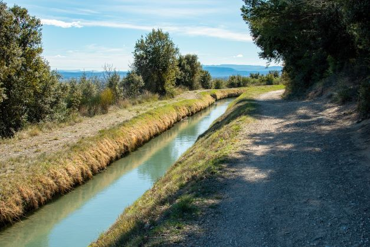
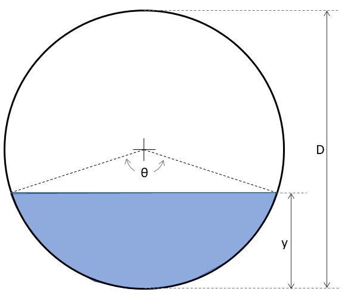
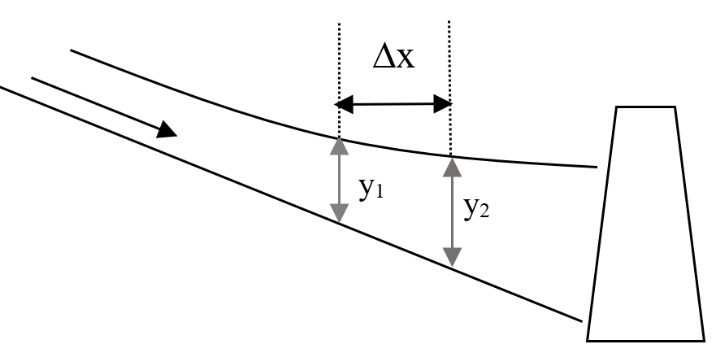

# Flow in open channels

Where flowing water water is exposed to the atmosphere, and thus not under pressure, its condition is called open channel flow.

```{r out.width='70%', echo=FALSE, fig.align="center"}
  
```

Typical design challenges can be:

- Determining how deep water will flow in a channel
- Finding the bottom slope required to carry a defined flow in a channel
- Comparing different cross-sectional shapes and dimensions to carry flow

In pipe flow the cross-sectional area does not change with flow rate, which simplifies some aspects of calculations. By contrast, in open channel flow conditions including flow depth, area, and roughness can all vary with flow rate, which tends to make the equations more cumbersome. In civil engineering applications, roughness characteristics are not usually considered as variable with flow rate.

In what follows, three conditions for flow are considered:

- Uniform flow, where flow characteristics do not vary along the length of a channel
- Gradually varied flow, where flow responds to an obstruction or change in channel conditions with a gradual adjustment in flow depth
- Rapidly varied flow, where an abrupt channel transition results in a rapid change in water surface, the most important case of which is the hydraulic jump

## An important dimensionless quantity

For open channel flow, given a channel shape and flow rate, flow can usually exist at two different depths, termed subcritical (slow, deep) and supercritical (shallow, fast). The exception is at critical flow conditions, where only one depth exists, the critical depth. Which of these depths is exhibited by the flow is determined by the slope and roughness of the channel. 

The Froude number characterizes whether flow is critical, supercritical or subcritical, and is defined by Equation \@ref(eq:froude)

\begin{equation}
  Fr=\frac{V}{\sqrt{gD}}
  (\#eq:froude)
\end{equation}

The Froude number characterizes flow as:

```{r constants-1, echo=FALSE}
knitr::kable(data.frame(Fr=c("<1.0","=1.0",">1.0"), Condition=c("subcritical","critical","supercritical"), Description=c("slow, deep","undulating, transitional","fast, shallow")), format="pipe", padding=0)
```

Critical flow is important in open-channel flow applications and is discussed further below. 

## Equations for open channel flow

Flow conditions in an open channel under uniform flow conditions are often related by the Manning equation \@ref(eq:man-1).
\begin{equation}
  Q=A\frac{C}{n}{R}^{\frac{2}{3}}{S}^{\frac{1}{2}}
  (\#eq:man-1)
\end{equation}

In Equation \@ref(eq:man-1), _C_ is 1.0 for _SI_ units and 1.49 for _Eng_ (British Gravitational, English., or U.S. Customary) units. _Q_ is the flow rate, _A_ is the cross-sectional flow area, _n_ is the Manning roughness coefficient, _S_ is the longitudinal channel slope, and R is the hydraulic radius, defined by equation \@ref(eq:hydrad-1)
\begin{equation}
  R=\frac{A}{P}
  (\#eq:hydrad-1)
\end{equation}
where P is the wetted perimeter.

Critical depth is defined by the relation (at critical conditions) in Equation \@ref(eq:crit-1)
\begin{equation}
  \frac{Q^{2}B}{g\,A^{3}}=1
  (\#eq:crit-1)
\end{equation}
where B is the width of the water surface (top width).

Because of the channel geometry being included in _A_ and _R_, it helps to work with specific shapes in adapting these equations. The two most common are trapezoidal and circular, included in Sections \@ref(trap) and \@ref(circ) below.

As with pipe flow, the energy equation applies for one dimensional open channel flow as well, Equation \@ref(eq:ocenergy-1):
\begin{equation}
  \frac{V_1^2}{2g}+y_1+z_1=\frac{V_2^2}{2g}+y_2+z_2+h_L
  (\#eq:ocenergy-1)
\end{equation}
where point 1 is upstream of point 2, _V_ is the flow velocity, _y_ is the flow depth, and _z_ is the elevation of the channel bottom. $h_L$ is the energy head loss from point 1 to point 2. For uniform flow, $h_L$ is the drop in elevation between the two points due to the channel slope.

## Trapezoidal channels {#trap}

In engineering applications one of the most common channel shapes is trapezoidal.

```{r TrapezoidGeometry, echo=FALSE, fig.cap="Typical symmetrical trapezoidal cross section", fig.align="center"}
knitr::include_graphics("images/trapezoid.PNG")
```

The geometrical relationships for a trapezoid are:
\begin{equation}
  A=(b+my)y
  (\#eq:trapg1)
\end{equation}

\begin{equation}
  P=b+2y\sqrt{1+m^2}
  (\#eq:trapg2)
\end{equation}

Combining Equations \@ref(eq:trapg1) and \@ref(eq:trapg2) yields:
\begin{equation}
  R=\frac{A}{P}=\frac{\left(b+my\right)y}{b+2y\sqrt{1+m^2}}
  (\#eq:trapg3)
\end{equation}

Top width: $B=b+2\,m\,y$.

Substituting Equations \@ref(eq:trapg1) and \@ref(eq:trapg3) into the Manning equation produces Equation \@ref(eq:man-2).
\begin{equation}
  Q=\frac{C}{n}{\frac{\left(by+my^2\right)^{\frac{5}{3}}}{\left(b+2y\sqrt{1+m^2}\right)^\frac{2}{3}}}{S}^{\frac{1}{2}}
  (\#eq:man-2)
\end{equation}

### Solving the Manning equation in R

To solve Equation \@ref(eq:man-2) when any variable other than _Q_ is unknown, it is straightforward to rearrange it to a form of y(x) = 0. 
\begin{equation}
  Q-\frac{C}{n}{\frac{\left(by+my^2\right)^{\frac{5}{3}}}{\left(b+2y\sqrt{1+m^2}\right)^\frac{2}{3}}}{S}^{\frac{1}{2}}=0
  (\#eq:man-3)
\end{equation}
This allows the use of a standard solver to find the root(s). If solving it by hand, trial and error can be employed as well.

Example \@ref(exm:oc-1) demonstrates the solution of Equation \@ref(eq:man-3) for the flow depth, _y_. A trial-and-error approach can be applied, and with careful selection of guesses a solution can be obtained relatively quickly. Using solvers makes the process much quicker and less prone to error.

::: {.example #oc-1}
Find the flow depth, y, for a trapezoidal channel with Q=225 ft^3^/s, n=0.016, m=2, b=10 _ft_, S=0.0006.
:::
The Manning equation can be set up as a function in terms of a missing variable, here using normal depth, y as the missing variable.
```{r manningt-1}
yfun <- function(y) {
  Q - (((y * (b + m * y)) ^ (5 / 3) * sqrt(S)) * (C / n) / ((b + 2 * y * sqrt(1 + m ^ 2)) ^ (2 / 3)))
  }
```

Because these use US Customary (or English) units, C=1.486. Define all of the needed input variables for the function.
```{r manningt-input}
Q <- 225.
n <- 0.016
m <- 2
b <- 10.0
S <- 0.0006
C <- 1.486
```

Use the _R_ function _uniroot_ to find a single root within a defined interval. Set the interval (the range of possible y values in which to search for a root) to cover all plausible values, here from 0.0001 mm to 200 m.
```{r manningt-2}
ans <- uniroot(yfun, interval = c(0.0000001, 200), extendInt = "yes")
cat(sprintf("Normal Depth: %.3f ft\n", ans$root))
```

Functions can usually be given multiple values as input, returning the corresponding values of output. this allows plots to be created to show, for example, how the left side of Equation \@ref(eq:man-3) varies with different values of depth, _y_.
```{r manningt-plot, out.width="60%", fig.align="center"}
ys <- seq(0.1, 5, 0.1)
plot(ys,yfun(ys), type='l', xlab = "y, ft", ylab = "Function to solve for zero")
abline(h=0)
grid()
```

This validates the result in the example, showing the root of Equation \@ref(eq:man-3), when the function has a value of _0_, occurs for a depth, _y_ of a little less than 3.5.

### Solving the Manning equation with the _hydraulics_ R package

The _hydraulics_ package has a _manningt_ (the 't' is for 'trapezoid') function for trapezoidal channels. Example \@ref(exm:oc-2) demonstrates its usage.

::: {.example #oc-2}
Find the uniform (normal) flow depth, y, for a trapezoidal channel with Q=225 ft^3^/s, n=0.016, m=2, b=10 _ft_, S=0.0006.
:::
Specifying "Eng" units ensures the correct C value is used. _Sf_ is the same as _S_ in Equations \@ref(eq:man-1) and \@ref(eq:man-2) since flow is uniform.
```{r manningt-3, message=FALSE, warning=FALSE}
ans <- hydraulics::manningt(Q = 225., n = 0.016, m = 2, b = 10., Sf = 0.0006, units = "Eng")
cat(sprintf("Normal Depth: %.3f ft\n", ans$y))
#critical depth is also returned, along with other variables.
cat(sprintf("Critical Depth: %.3f ft\n", ans$yc))
```

### Solving the Manning equation using a spreadsheet like Excel

Spreadsheet software is very popular and has been modified to be able to accomplish many technical tasks such as solving equations. This example uses Excel with its solver add-in activated, though other spreadsheet software has similar solver add-ins that can be used.

The first step is to enter the input data, for the same example as above, along with an initial guess for the variable you wish to solve for. The equation for which a root will be determined is typed in using the initial guess for _y_ in this case.

```{r Excel Solver Setup, echo=FALSE, fig.cap="", out.width = '70%', fig.align="center"}
knitr::include_graphics("images/sheets1.PNG")
```

At this point you could use a trial-and-error approach and simply try different values for _y_ until the equation produces something close to _0_.

A more efficient method is to use a solver. Check that the solver add-in is activated (in Options) and open it. Set the values appropriately.

```{r Excel Solver Input, echo=FALSE, fig.cap="", out.width = '70%', fig.align="center"}
knitr::include_graphics("images/sheets2.PNG")
```

Click Solve and the _y_ value that produces a zero for the equation will appear. 
```{r Excel Solver Solution, echo=FALSE, fig.cap="", out.width = '70%', fig.align="center"}
knitr::include_graphics("images/sheets3.PNG")
```

If you need to solve for multiple roots, you will need to start from different initial guesses.

### Optimal trapezoidal geometry

Most fluid mechanics texts that include open channel flow include a derivation of optimal geometry for a trapezoidal channel. This is also called the most efficient cross section. What this means is for a given _A_ and _m_, there is an optimal flow depth and bottom width for the channel, defined by Equations \ref(eq:topt1) and \ref(eq:topt2).

\begin{equation}
  b_{opt}=2y\left(\sqrt{1+m^2}-m\right)
  (\#eq:topt1)
\end{equation}
\begin{equation}
  y_{opt}=\sqrt{\frac{A}{2\sqrt{1+m^2}-m}}
  (\#eq:topt2)
\end{equation}

These may be calculated manually, but they are also returned by the _manningt_ function of the _hydraulics_ package in _R_. Example \@ref(exm:manningtopt) demonstrates this.

::: {.example #manningtopt}
Find the optimal channel width to transmit 360 ft^3^/s at a depth of 3 ft with n=0.015, m=1, S=0.0006. 
:::
```{r manningt-2-2, message=FALSE, warning=FALSE, fig.width = 4, fig.asp = 0.6}
ans <- hydraulics::manningt(Q = 360., n = 0.015, m = 1, y = 3.0, Sf = 0.00088, units = "Eng")
knitr::kable(format(as.data.frame(ans), digits = 2), format = "pipe", padding=0)
cat(sprintf("Optimal bottom width: %.5f ft\n", ans$bopt))
```

The results show that, aside from the rounding, the required width is approximately 20 ft, and the optimal bottom width for optimal hydraulic efficiency would be 4.76 ft. To check the depth that would be associated with a channel of the optimal width, substitute the optimal width for _b_ and solve for _y_:
```{r manningt-2-3, message=FALSE, warning=FALSE, fig.width = 4, fig.asp = 0.6}
ans <- hydraulics::manningt(Q = 360., n = 0.015, m = 1, b = 4.767534, Sf = 0.00088, units = "Eng")
cat(sprintf("Optimal depth: %.5f ft\n", ans$yopt))
```

## Circular Channels (flowing partially full) {#circ}

Civil engineers encounter many situations with circular pipes that are flowing only partially full, such as storm and sanitary sewers. 

```{r CircularGeometry, echo=FALSE, fig.cap="Typical circular cross section", fig.align="center"}

```

The relationships between the depth of water and the values needed in the Manning equation are:

Depth (or fractional depth as written here) is described by Equation \@ref(eq:circg1)
\begin{equation}
  \frac{y}{D}=\frac{1}{2}\left(1-\cos{\frac{\theta}{2}}\right)
  (\#eq:circg1)
\end{equation}

Area is described by Equation \@ref(eq:circg2)
\begin{equation}
  A=\left(\frac{\theta-\sin{\theta}}{8}\right)D^2
  (\#eq:circg2)
\end{equation}
(Be sure to use theta in radians.)

Wetted perimeter is described by Equation \@ref(eq:circg3)
\begin{equation}
  P=\frac{D\theta}{2}
  (\#eq:circg3)
\end{equation}

Combining Equations \@ref(eq:circg2) and \@ref(eq:circg3):
\begin{equation}
  R=\frac{D}{4}\left(1-\frac{\sin{\theta}}{\theta}\right)
  (\#eq:circg4)
\end{equation}

Top width: $B=D\,sin{\frac{\theta}{2}}$

Substituting Equations \@ref(eq:circg2) and \@ref(eq:circg4) into the Manning equation, Equation \@ref(eq:man-1), produces \@ref(eq:man-c).
\begin{equation}
  \theta^{-\frac{2}{3}}\left(\theta-\sin{\theta}\right)^\frac{5}{3}-CnQD^{-\frac{8}{3}}S^{-\frac{1}{2}}=0
  (\#eq:man-c)
\end{equation}
where C=20.16 for SI units and C=13.53 for US Customary (English) units.

### Solving the Manning equation for a circular pipe in R

As was demonstrated with pipe flow, a function could be written with Equation \@ref(eq:man-c) and a solver applied to find the value of $\theta$ for the given flow conditions with a known D, S, n and Q. The value for $\theta$ could then be used with Equations \@ref(eq:circg1), \@ref(eq:circg2) and \@ref(eq:circg3) to recover geometric values.

The _R_ package _hydraulics_ has implemented those routines to enable these calculations. 
For an existing pipe, a common problem is the determination of the depth, _y_ that a given flow _Q_, will have given a pipe diameter _d_, slope _S_ and roughness _n_. Example \@ref(exm:circx1) demonstrates this.

::: {.example #circx1}
Find the uniform (normal) flow depth, y, for a trapezoidal channel with Q=225 ft^3^/s, n=0.016, m=2, b=10 _ft_, S=0.0006.
:::
The function _manningc_ from the _hydraulics_ package is used. Any one of the variables in the Manning equation, and related geometric variables, may be treated as an unknown. 

```{r manningc-1, message=FALSE, warning=FALSE}
ans <- hydraulics::manningc(Q=0.01, n=0.013, Sf=0.001, d = 0.2, units="SI", ret_units = TRUE)
knitr::kable(format(as.data.frame(ans), digits = 2), format = "pipe", padding=0)
```

It is also sometimes convenient to see a cross-section diagram.
```{r manningc-2, message=FALSE, warning=FALSE, out.width="40%"}
hydraulics::xc_circle(y = ans$y, d=ans$d, units = "SI")
```

## Critical flow {#crit-section}

Critical flow in open channel flow is described in general by Equation \@ref(eq:crit-1).

For any channel geometry and flow rate a convenient plot is a specific energy diagram, which illustrates the different flow depths that can occur for any given specific energy. Specific energy is defined by Equation \@ref(eq:spen1).
\begin{equation}
  E=y+\frac{V^2}{2g}
  (\#eq:spen1)
\end{equation}
It can be interpreted as the total energy head, or energy per unit weight, relative to the channel bottom.

For a **trapezoidal** channel, critical flow conditions occur as described by Equation \@ref(eq:crit-1). Combining that with trapezoidal geometry produces Equation \@ref(eq:spen2)
\begin{equation}
  \frac{Q^2}{g}=\frac{\left(by_c+m{y_c}^2\right)^3}{b+2my_c}
  (\#eq:spen2)
\end{equation}
where $y_c$ indicates critical flow depth.

This is important for understanding what may happen to the water surface when flow encounters an obstacle or transition. For the channel of Example \@ref(exm:manningtopt), the diagram is 
```{r manningt-4, fig.width = 4, fig.asp = 1.0}
hydraulics::spec_energy_trap( Q = 360, b = 20, m = 1, scale = 4, units = "Eng" )
```

This provides an illustration that for y=3 ft the flow is subcritical (above the critical depth). Specific energy for the conditions of the prior example is 
$$E=y+\frac{V^2}{2g}=3.0+\frac{5.22^2}{2*32.2}=3.42 ft$$

If the channel bottom had an abrupt rise of $E-E_c=3.42-3.03=0.39 ft$ critical depth would occur over the hump. A rise of anything greater than that would cause damming to occur. Once flow over a hump is critical, downstream of the hump the flow will be in supercritical conditions, flowing at the _alternate depth_.

The specific energy for a given depth _y_ and alternate depth can be added to the plot by including an argument for depth, y.
```{r manningt-5, fig.width = 4, fig.asp = 1.0}
hydraulics::spec_energy_trap( Q = 360, b = 20, m = 1, scale = 4, y=3.0, units = "Eng" )
```

## Gradually varied steady flow {#gvf-section}

When water approaches an obstacle, it can back up, with its depth increasing. The effect can be observed well upstream. Similarly, as water approaches a drop, such as with a waterfall, the water level declines, and that effect can also be seen upstream. In general, any change in slope or roughness will produce changes in depth along a channel length. 

There are three depths that are important to define for a channel:
$y_c$, critical depth, found using Equation \@ref(eq:crit-1)
$y_0$, normal depth, found using Equation \@ref(eq:man-1)
$y$, flow depth, found using Equation \@ref(eq:ocenergy-1)

If $y_n < y_c$ flow is supercritical (for example, flowing down a steep slope); if $y_n > y_c$ flow is subcritical. Variations in the water surface are classified by profile types based on to whether the normal flow is subcritical (or mild sloped, M) or supercritical (steep, S), as in Figure \@ref(fig:gvfcurves) [@davidian_jacob_computation_1984].
```{r gvfcurves, echo=FALSE, fig.cap="Types of flow profiles on mild and steep slopes", fig.align="center"}
knitr::include_graphics("images/gvf-curves.PNG")
```

In addition to channel transitions, changes in channel slow of roughness (Manning _n_) will cause the flow surface to vary. Some of these conditions are illustrated in Figure \@ref(fig:gvfcurves2) [@davidian_jacob_computation_1984].
```{r gvfcurves2, echo=FALSE, fig.cap="Types of flow profiles with changes in slope or roughness", fig.align="center"}
knitr::include_graphics("images/gvf-n-S-transitions.PNG")
```

Typically, for supercritical flow the calculations start at an upstream cross section and move downstream. For subcritical flow calculations proceed upstream. However, for the direct step method, a negative result will indicate upstream, and a positive result indicates downstream.

If the water surface passes through critical depth (from supercritical to subcritical or the reverse) it is no longer gradually varied flow and the methods in this section do not apply. This can happen at abrupt changes in channel slope or roughness, or channel transitions.

### The direct step method

The direct step method looks at two cross sections in a channel where depths, $y_1$ and $y_2$ are defined. 
```{r gvffig1, out.width='60%', echo=FALSE, fig.align="center"}
  
```

The distance between these two cross-sections, ${\Delta}X$, is calculated using Equation \@ref(eq:gvf1)
\begin{equation}
  {\Delta}X=\frac{E_1-E_2}{\overline{S}-S_0}
  (\#eq:gvf1)
\end{equation}
Where E is the specific energy from Equation \@ref(eq:spen1), $S_0$ is the slope of the channel bed, and $S$ is the slope of the energy grade line. $\overline{S}$ is the average of the S values at each cross section calculated using the Manning equation, Equation \@ref(eq:man-1) solved for slope, as in Equation \@ref(eq:man-gvf).
\begin{equation}
  S=\frac{n^2\,V^2}{C^2\,R^{\frac{4}{3}}}
  (\#eq:man-gvf)
\end{equation}

Example \@ref(exm:gvfx1) demonstrates this.

::: {.example #gvfx1}
Water flows at 10 m^3^/s in a trapezoidal channel with n=0.015, bottom width 3 m, side slope of 2:1 (H:V) and longitudinal slope 0.0009 (0.09%). At the location of a USGS stream gage the flow depth is 1.4 m. Use the direct step method to find the distance to the point where the depth is 1.2 m and determine whether it is upstream or downstream.
:::
Begin by setting up a function to calculate the Manning slope and setting up the input data.
```{r gvfsol-1, message=FALSE, warning=FALSE}
#function to calculate Manning slope
slope_f <- function(V,n,R,C) {
  return(V^2*n^2/(C^2*R^(4./3.)))
}
#Now set up input data ##################################
#input Flow
Q=10.0
#input depths:
y1 <- 1.4 #starting depth
y2 <- 1.2 #final depth
#Define the number of steps into which the difference in y will be broken
nsteps <- 2

#channel geometry:
bottom_width <- 3
side_slope <- 2         #side slope is H:V. Use zero for rectangular
manning_n <- 0.015
long_slope <- 0.0009
units <- "SI"           #"SI" or "Eng"
if (units == "SI") {
  C <- 1                #Manning constant: 1 for SI, 1.49 for US units
  g <- 9.81             
} else {                #"Eng" means English, or US system
  C <- 1.49
  g <- 32.2
}

#find depth increment for each step, depths at which to solve
depth_incr <- (y2 - y1) / nsteps
depths <- seq(from=y1, to=y2, by=depth_incr)
```

First check to see if the flow is subcritical or supercritical and find the normal depth. Critical and normal depths can be calculated using the _manningt_ function in the _hydraulics_ package, as in Example \@ref(exm:oc-2). However, because other functionality of the [rivr](https://cran.r-project.org/package=rivr) package is used, these will be calculated using functions from the _rivr_ package. 
```{r gvfsol-2, message=FALSE, warning=FALSE}
rivr::critical_depth(Q = Q, yopt = y1, g = g, B = bottom_width , SS = side_slope)
#note using either depth for yopt produces the same answer
rivr::normal_depth(So = long_slope, n = manning_n, Q = Q, yopt = y1, Cm = C, B = bottom_width , SS = side_slope)
```

The normal depth is greater than the critical depth, so the channel has a mild slope. The beginning and ending depths are above normal depth. This indicates the profile type, following Figure \@ref(fig:gvfcurves), is **M-1**, so the flow depth should decrease in depth going upstream. This also verifies that the flow depth between these two points does not pass through critical flow, so is a valid gradually varied flow problem.

For each increment the ${\Delta}X$ value needs to be calculated, and they need to be accumulated to find the total length, L, between the two defined depths.
```{r gvfsol-3, message=FALSE, warning=FALSE}
#loop through each channel segment (step), calculating the length for each segment. 
#The channel_geom function from the rivr package is helpful
L <- 0
for ( i in 1:nsteps ) {
  #find hydraulic geometry, E and Sf at first depth
  xc1 <- rivr::channel_geom(y=depths[i], B=bottom_width, SS=side_slope)
  V1 <- Q/xc1[['A']]
  R1 <- xc1[['R']]
  E1 <- depths[i] + V1^2/(2*g)
  Sf1 <- slope_f(V1,manning_n,R1,C)
  
  #find hydraulic geometry, E and Sf at second depth
  xc2 <- rivr::channel_geom(y=depths[i+1], B=bottom_width, SS=side_slope)
  V2 <- Q/xc2[['A']]
  R2 <- xc2[['R']]
  E2 <- depths[i+1] + V2^2/(2*g)
  Sf2 <- slope_f(V2,manning_n,R2,C)
  
  Sf_avg <- (Sf1 + Sf2) / 2.0
  dX <- (E1 - E2) / (Sf_avg - long_slope)
  L <- L + dX
}
cat(sprintf("Using %d steps, total distance from depth %.2f to %.2f = %.2f m\n", nsteps, y1, y2, L))
```

The result is negative, verifying that the location of depth y2 is upstream of y1. Of course, the result will become more precise as more incremental steps are included, as shown in Figure \@ref(fig:gvfmultiple)
```{r gvfmultiple, out.width='70%', echo=FALSE, fig.align="center", fig.cap="Variation of number of calculation steps to final calculated distance."}
  knitr::include_graphics("images/gvf_multiplesteps.png")
```

The direct step method is also implemented in the _hydraulics_ package, and can be applied to the same problem as above, as illustrated in Example \@ref(exm:gvfx1b).

::: {.example #gvfx1b}
Water flows at 10 m^3^/s in a trapezoidal channel with n=0.015, bottom width 3 m, side slope of 2:1 (H:V) and longitudinal slope 0.0009 (0.09%). At the location of a USGS stream gage the flow depth is 1.4 m. Use the direct step method to find the distance to the point where the depth is 1.2 m and determine whether it is upstream or downstream.
:::
```{r ds-1, fig.width = 4, fig.asp = 1.0}
hydraulics::direct_step(So=0.0009, n=0.015, Q=10, y1=1.4, y2=1.2, b=3, m=2, nsteps=2, units="SI")
```

This produces the same result, and verifies that the water surface profile is type M-1.

### Standard step method

The standard step method works similarly to the direct step method, except from one known depth the second depth is determined at a known distance, _L_. This is a preferred method when the depth at a critical location, such as a bridge, is needed.

The [rivr](https://cran.r-project.org/package=rivr) package implements the standard step method in its _compute\_profile_ function. To compare it to the direct step method, check the depth at $y_2$ given the total distance from Example \@ref(exm:gvfx1).

::: {.example #gvfx2}
For the same channel and flow rate as Example \@ref(exm:gvfx1), determine the depth of water at the distance _L_ determined above.
:::
The function requires the distance to be positive, so apply the absolute value to the _L_ value. 
```{r gvfsol-4, message=FALSE, warning=FALSE}
dist = abs(L)
ans <- rivr::compute_profile(So = long_slope, n = manning_n, Q = Q, y0 = y1, Cm = C, g = g, B = bottom_width, SS = side_slope, stepdist = dist/nsteps, totaldist = dist)
#Distances along the channel where depths were determined
ans$x
#Depths at each distance
ans$y
```

This shows the distances and depths at each of the steps defined. Consistent with the above, the distances are negative, showing that they are progressing upstream. The results are identical for $y_2$ using the direct step method.

## Rapidly varied flow (the hydraulic jump) {#hj-section}

```{r hj-0, echo=FALSE, fig.align="center", fig.cap="A hydraulic jump at St. Anthony Falls, Minnesota."}
  knitr::include_graphics("images/StAnthonyFalls_apron.JPG")
```

In the discussion of critical flow in Section \@ref(crit-section), the concept of alternate depths was introduced, where a given flow rate in a channel with known geometry typically may assume two possible values, one subcritical and one supercritical. For the case of supercritical flow transitioning to subcritical flow, a smooth transition is impossible, so a hydraulic jump occurs. A hydraulic jump always dissipates some of the incoming energy. A hydraulic jump is depicted in Figure \@ref(fig:hj-1) [@peterka_alvin_j_hydraulic_1978].

```{r hj-1, echo=FALSE, fig.align="center", fig.cap="A typical hydraulic jump."}
  knitr::include_graphics("images/hydr_jump_usbr.PNG")
```

### Sequent (or conjugate) depths

The two depths on either side of a hydraulic jump are called **sequent depths** or **conjugate depths**. The relationship between them can be established using the momentum equation to develop an general expression (for any open channel) for the **momentum function, M**, as in Equation \@ref(eq:hj-eq1).
\begin{equation}
  M=Ah_c+\frac{Q^2}{gA}
  (\#eq:hj-eq1)
\end{equation}
where $h_c$ is the distance from the water surface to the centroid of the channel cross-section. For a **trapezoidal** channel, the momentum equation becomes that described by Equation \@ref(eq:hj-eq2).
\begin{equation}
  M=\frac{by^2}{2}+\frac{my^3}{3}+\frac{Q^2}{gy\left(b+my\right)}
  (\#eq:hj-eq2)
\end{equation}

For the case of a **rectangular** channel, setting m=0 and setting the Momentum function for two sequent depths, y~1~ ans y~2~ equal, produces the relationship in Equation  \@ref(eq:hj-eq3).
\begin{equation}
  \frac{y_2}{y_1}=\frac{1}{2}\left(-1+\sqrt{1+8Fr_1^2}\right)
  or
  \frac{y_1}{y_2}=\frac{1}{2}\left(-1+\sqrt{1+8Fr_2^2}\right)
  (\#eq:hj-eq3)
\end{equation}
where Fr~n~ is the Froude Number [Equation \@ref(eq:froude)] at section n.

Again, for the case of a **rectangular** channel, the energy head loss through a hydraulic jump simplifies to Equation  \@ref(eq:hj-eq4).
\begin{equation}
  h_l=\frac{\left(y_2-y_1\right)^3}{4y_1y_2}
  (\#eq:hj-eq4)
\end{equation}

Given that the momentum function must be conserved on either side of a hydraulic jump, finding the sequent depth for any known depth becomes straightforward for trapezoidal shapes. Setting M~1~ = M~2~ in Equation \@ref(eq:hj-eq2) allows the use of a solver, as in Example  \@ref(exm:seq-x1).

::: {.example #seq-x1}
A trapezoidal channel with a bottom width of 0.5 m and a side slope of 1:1 carries a flow of 0.2 m^3/s. The depth on one side of a hydraulic jump is 0.1 m. Find the sequent depth, the energy head loss, and the power dissipation in Watts.
:::
```{r hydj-x1, message=FALSE, warning=FALSE}
flow <- 0.2
ans <- hydraulics::sequent_depth(Q=flow,b=0.5,y=0.1,m=1,units = "SI", ret_units = TRUE)
#print output of function
ans
#Find energy head loss
hl <- abs(ans$E - ans$E_seq)
hl
#Express this as a power loss
gamma <- hydraulics::specwt(units = "SI")
P <- gamma*flow*hl
cat(sprintf("Power loss = %.1f Watts\n",P))
```

The energy loss across hydraulic jumps varies with the Froude number of the incoming flow, as shown in  depicted in Figure \@ref(fig:hj-2) [@peterka_alvin_j_hydraulic_1978].

```{r hj-2, echo=FALSE, fig.align="center", fig.cap="Types of hydraulic jumps."}
  knitr::include_graphics("images/hydr_jump_forms_usbr.PNG")
```

### Location of a hydraulic jump

In hydraulic infrastructure where hydraulic jumps will occur there are usually engineered features, such as baffles or basins, to force a hydraulic jump to occur in specific locations, to protect downstream waterways from the turbulent effects of an uncontrolled hydraulic jump. In the absence of engineered features to cause a jump, the location of a hydraulic jump can be determined using the concepts of Sections \@ref{gvf-section} and \@ref{hj-section}.

Example \@ref(exm:hj-loc) demonstrates the determination of the location of a hydraulic jump when normal flow conditions exist at some distance upstream and downstream of the jump.

::: {.example #hj-loc}
A rectangular (a trapezoid with side slope, m=0) concrete channel with a bottom width of 3 m carries a flow of 8 m^3/s. The upstream channel slopes steeply at S~o~=0.018 and discharges onto a mild slope of S~o~=0.0015. Determine the height of the jump and its location.
:::
First find the normal depth on each slope, and the critical depth for the channel.
```{r hydj-loc1, message=FALSE, warning=FALSE}
yn1 <- hydraulics::manningt(Q = 8, n = 0.013, m = 0, Sf = 0.018, b = 3, units = "SI")$y
yn2 <- hydraulics::manningt(Q = 8, n = 0.013, m = 0, Sf = 0.0015, b = 3, units = "SI")$y
yc <- hydraulics::manningt(Q = 8, n = 0.013, m = 0, Sf = 0.0015, b = 3, units = "SI")$yc
cat(sprintf("yn1 = %.3f m, yn2 = %.3f m, yc = %.3f m\n", yn1, yn2, yc))
```
Recall that the calculation of yc only depends on flow and channel geometry (Q, b, m), so the values of n and Sf can be arbitrary for that command. These results confirm that flow is supercritical upstream and subcritical downstream, so a hydraulic jump will occur.

The hydraulic jump will either begin at _yn1_ (and jump to the sequent depth for _yn1_) or end at _yn2_ (beginning at the sequent depth for _yn2_). The possibilities are shown in Figure \@ref(fig:gvfcurves) in the lower right panel. First check the two sequent depths.
```{r hydj-loc2, message=FALSE, warning=FALSE}
yn1_seq <- hydraulics::sequent_depth(Q = 8, b = 3, y=yn1, m = 0, units = "SI")$y_seq
yn2_seq <- hydraulics::sequent_depth(Q = 8, b = 3, y=yn2, m = 0, units = "SI")$y_seq
cat(sprintf("yn1_seq = %.3f m, yn2_seq = %.3f m\n", yn1_seq, yn2_seq))
```
This confirms that if the jump began at _yn1_ (on the steep slope) it would need to jump a level below _yn2_, with an **S-1** curve providing the gradual increase in depth to _yn2_. Since _yn1_seq_ exceeds _yn2_, this is not possible. That can be verified using the _direct_step_ function to show the distance from _yn1_seq_ to _yn2_ would need to be _upstream_ (negative x values in the result), which cannot occur for this case. This means the alternate case must exist, with an M-3 profile raising yn1 to yn2_seq at which point the jump occurs. The direct step method can find this distance along the channel.
```{r hydj-loc3, message=FALSE, warning=FALSE}
hydraulics::direct_step(So=0.0015, n=0.013, Q=8, y1=yn1, y2=yn2_seq, b=3, m=0, nsteps=2, units="SI")
```
The number of calculation steps (nsteps) can be increased for greater precision, but 2 steps is adequate here.

