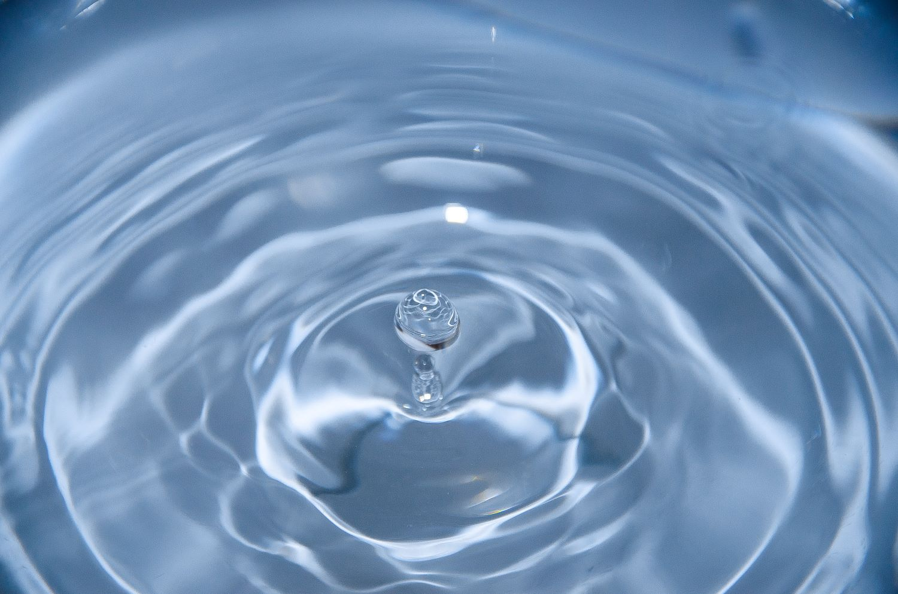
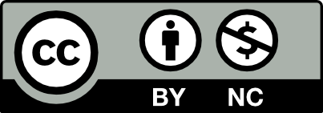
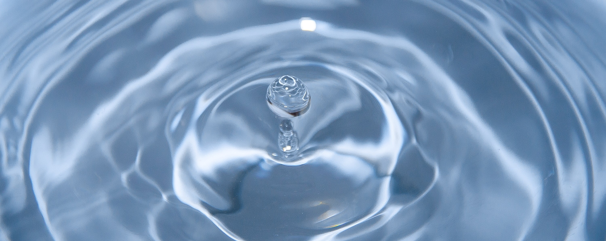

--- 
title: 'Hydraulics and Water Resources: Examples Using R'
author:
- name: '[Ed Maurer](https://www.engr.scu.edu/~emaurer)'
  affiliation: "Professor, [Civil, Environmental, and Sustainable Engineering Department,
    Santa Clara University](https://www.scu.edu/engineering/academic-programs/engineering/ce/)"
    
date: "`r Sys.Date()`"
output: html_document
documentclass: book
bibliography: "ed-bookdown.bib"
csl: water-resources-research.csl
description: "A compilation of fluid mechanics, hydraulics, and water resources \nengineering
  exercises using R.\n"
link-citations: yes
always_allow_html: yes
site: bookdown::bookdown_site
---

#

```{r, include = FALSE}
knitr::opts_chunk$set(
  collapse = TRUE,
  comment = "#>"
)
```

# Preface {-}

This is a compilation of various R exercises and examples created over many years. They have been used mostly in undergraduate civil engineering classes including fluid mechanics, hydraulics, and water resources. This is a dynamic work, and will be regularly updated as errors are identified, improved presentation is developed, or new topics or examples are introduced. I welcome any suggestions or comments.

In what follows, text will be intentionally brief. More extensive discussion and description can be found in any fluid mechanics, applied hydraulics, or water resources engineering text. Symbology for hydraulics in this reference generally follows that of Finnemore and Franzini [-@finnemore_fluid_2002]. Fundamental equations will be introduced though the emphasis will be on applications to solve common problems. Also, since this is written by a civil engineer, the only fluids included are water and air, since that accounts for nearly all problems encountered in the field.

Solving water problems is rarely done by hand calculations, though the importance of performing order of magnitude 'back of the envelope' calculations cannot be overstated. Whether using a hand calculator, spreadsheet, or a programming language to produce a solution, having a sense of when an answer is an outlier will help catch errors. 

Scripting languages are powerful tools for performing calculations, providing a fully traceable and reproducible path from your input to a solution. Open source languages have the benefit of being free to use, and invite users to be part of a community helping improve the language and its capabilities. The language of choice for this book is R [@r_core_team_r_2022], chosen for its straightforward syntax, powerful graphical capabilities, wide use in engineering and in many other disciplines, and by using the RStudio interface, it can look and feel a lot like Matlab`r knitr::asis_output("\U00AE")` with which most engineering students have some experience.

## Introduction to R and RStudio

No introduction to R or RStudio is provided here. It is assumed that the reader has installed R (and RStudio), is comfortable installing and updating packages, and understands the basics of R scripting. Some resources that can provide an introduction to R include:

- [A brief overview](https://www.engr.scu.edu/~emaurer/shared/R-intro/), aimed at students at Santa Clara University. 
- [An Introduction to R](https://cran.r-project.org/doc/manuals/R-intro.html), a comprehensive reference by the R Core Team.
- [Introduction to Programming with R](https://discdown.org/rprogramming/) by Stauffer et al., materials for a university course, including interactive exercises.
- [R for Water Resources Data Science](https://www.r4wrds.com/), with both introductory and intermediate level courses online.

As I developed these exercises and text, I learned R through the work of many others, and the excellent help offered by skilled people sharing their knowledge on [stackoverflow](https://stackoverflow.com/questions/tagged/r). The methods shown here are not the only ways to solve these problems, and users are invited to share alternative or better solutions.

## Copyight {-}

This work is provided under a Creative Commons Attribution-NonCommercial 4.0 International (CC BY-NC 4.0). As a summary, this license allows reusers to distribute, remix, adapt, and build upon the material in any medium or format for noncommercial purposes only, and only so long as attribution is given to the creator. This is a summary of (and not a substitute for) the [license](https://creativecommons.org/licenses/by-nc/4.0/legalcode).
``` {r echo=FALSE, out.width = '15%'}
 
```

```{js, echo = FALSE}
title=document.getElementById('header');
title.innerHTML = '' + title.innerHTML
```
